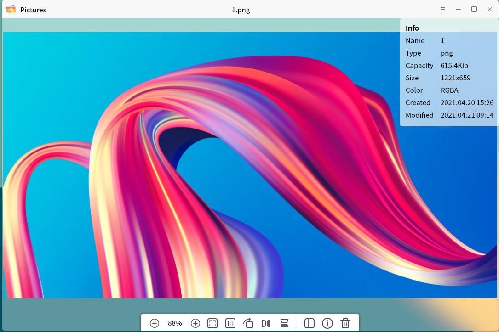

# Kylin Photo Viewer
## Overview
麒麟看图是一款简单易用，界面友好，支持多种图片格式的图片查看器。在查看图片的同时，还可以对图片进行简单的编辑和处理，例如：放大、缩小、旋转、翻转、删除等。除此之外，还可以查看图片的详细信息。主界面如图1所示。

 

## Basic Function
Icons and Function:

| Icon | Function | Icon | Function |
| :------------ | :------------ | :------------ | :------------ |
||	Open image	||	Previous
||	Next||	Enlarge
||	Shrink||	Show as normal size
||	Fit to the window||Rotate 90 degrees
||	Flip horizontally||Flip vertical
||	View details|| Delete to trash

 

点击主界面“+”按钮或者“”按钮的“打开...”选项，打开一张图片，如文件夹下有多张图片，则可点击“上一张”或“下一张”按钮进行切换。如图2所示。

 

## Toolbar
工具栏主要提供一些对图片的操作，包括：缩小、放大、查看图片原始尺寸、适应窗口尺寸、旋转、水平翻转、垂直翻转、查看图片详细信息、删除。
改变尺寸的功能包括：缩小、放大、查看图片原始尺寸、适应窗口尺寸。以放大为例，点击工具栏的“”按钮，可对图片进行放大。当图片放大到超出主界面可视范围时，拖动导航器中间的高亮窗口，用户可查看图片全貌。如图3所示。

对图片旋转的功能包括：旋转、水平镜像和处置镜像。以旋转为例，每次点击工具栏的“”按钮，可对图片进行90°顺时针旋转。如图4所示。

点击工具栏的“”按钮，可以在主界面的右上角窗口查看当前图片的详细信息。如图5所示。

点击工具栏的“”按钮，可以将当前图片删除至回收站。

 

## Appendix
### Shortcut Key

| Shortcut | Function |
| :------------ | :------------ | 
|← | Previous
|→ | Next
|del | Delete

