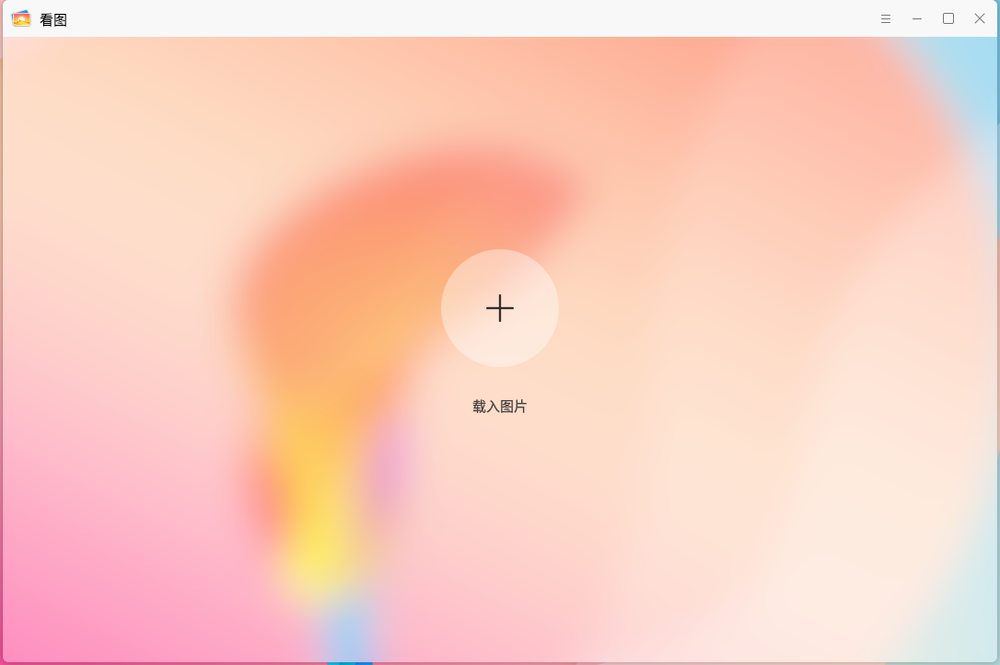
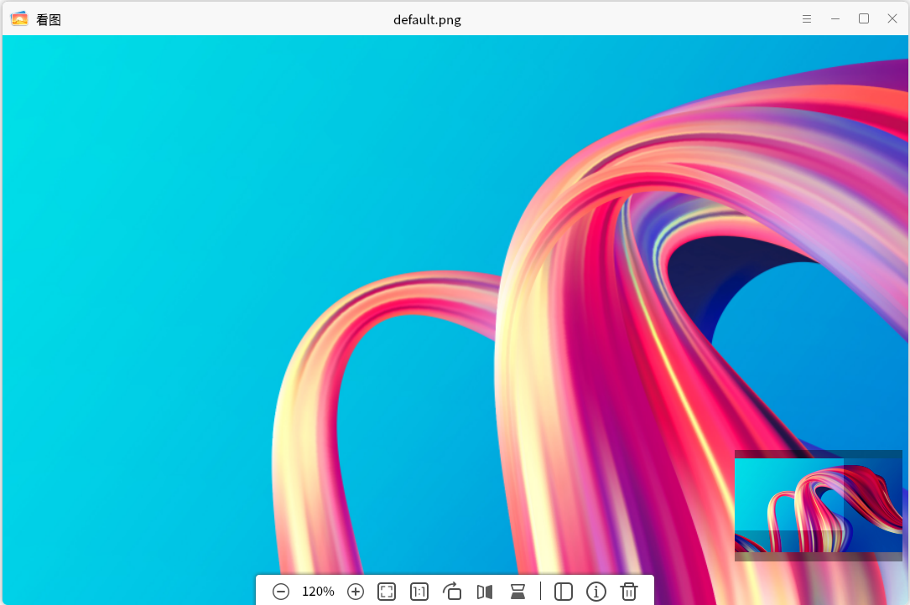
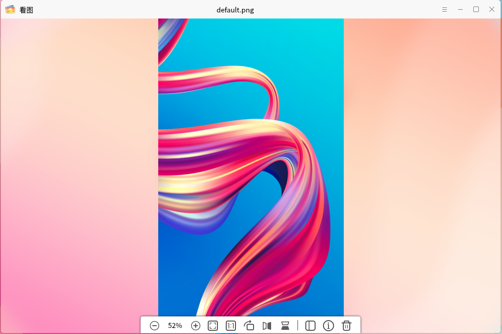
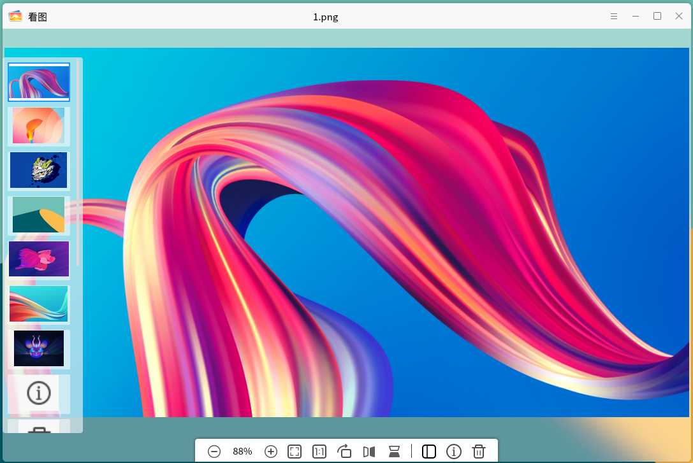
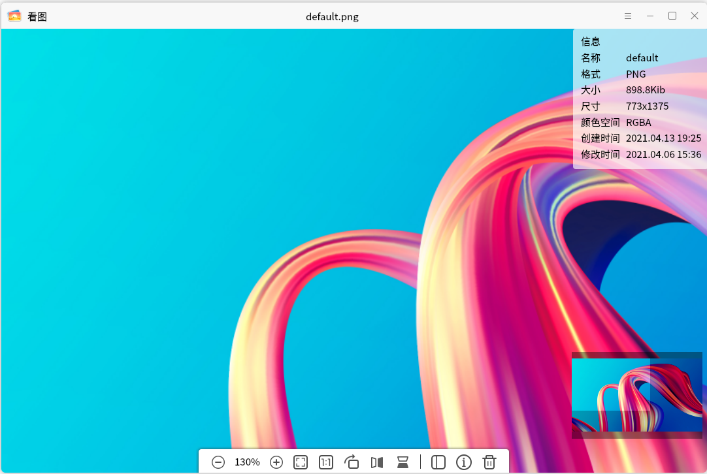

# 看图
## 概 述
看图是一款简单易用，界面友好，支持多种图片格式的图片查看器。在查看图片的同时，还可以对图片进行简单的编辑和处理，例如：放大、缩小、旋转、翻转、删除等。除此之外，还可以查看图片的详细信息。主界面如图1所示。

 

## 基本功能
图标及其功能:

|图 标	|功能说明	|图 标|	功能说明
| :------------ | :------------ | :------------ | :------------ |
||	打开图片	||	上一张
||	下一张||	放大
||	缩小||	正常大小显示图片
||	图像适合窗口||图片旋转90度
||	水平镜像||垂直镜像
||	查看图片详细信息|| 查看相册
||	删除到回收站

 

点击主界面“+”按钮或者“”按钮的“打开...”选项，打开一张图片，如文件夹下有多张图片，则可点击“上一张”或“下一张”按钮进行切换。如图2所示。

 

## 工具栏
工具栏主要提供一些对图片的操作，包括：缩小、放大、查看图片原始尺寸、适应窗口尺寸、旋转、水平翻转、垂直翻转、查看图片详细信息、删除。
改变尺寸的功能包括：缩小、放大、查看图片原始尺寸、适应窗口尺寸。以放大为例，点击工具栏的“”按钮，可对图片进行放大。当图片放大到超出主界面可视范围时，拖动导航器中间的高亮窗口，用户可查看图片全貌。如图3所示。

对图片旋转的功能包括：旋转、水平镜像和垂直镜像。以旋转为例，每次点击工具栏的“”按钮，可对图片进行90°顺时针旋转。如图4所示。

点击工具栏的“”按钮，可以在主界面的左侧查看当前图片所在文件夹的所有可支持图片的缩略图。点击某一个可切换主界面当前图片的显示。如图5所示。

点击工具栏的“”按钮，可以在主界面的右上角窗口查看当前图片的详细信息。如图6所示。

点击工具栏的“”按钮，可以将当前图片删除至回收站。

 

## 附 录
### 快捷键

| 快捷键 | 功能 |
| :------------ | :------------ | 
|← | 上一张
|→ | 下一张
|del | 删除

