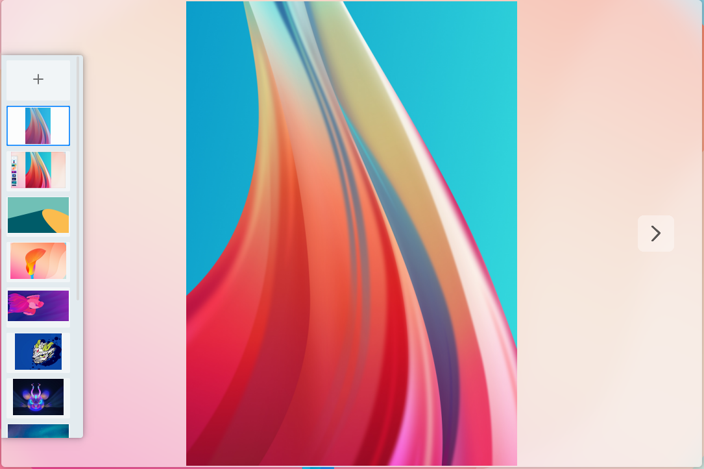
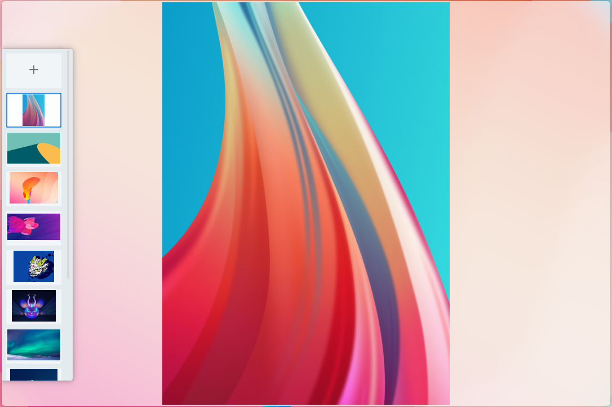

# Pictures
## Overview
Pictures is a simple, user-friendly image viewer that supports multiple image formats. While viewing the picture, you can also edit and process the picture simply, such as zooming in,
zooming out, rotating, flipping, deleting, etc. In addition, you can view the details of the picture. The main interface is shown in Figure 1.

 

## Basic Function
Icons and Function:

| Icon | Function | Icon | Function |
| :------------ | :------------ | :------------ | :------------ |
||	Open image	||	Previous
||	Next||	Enlarge
||	Shrink||	Show as normal size
||	Fit to the window||Rotate 90 degrees
||	Flip horizontally||Flip vertical
||	View details|| View album
|| Delete to trash

 

Click the "+" button in the main interface or the "" button to open a picture. If there are multiple pictures in the folder, the album will be displayed automatically. Click the album thumbnail or "next" button to switch. As shown in Figure 2.

 

## Toolbar
Toolbar mainly provides some operations on pictures, including: zoom out, zoom in, view the original size of the picture, adapt to the size of the window, rotate, flip horizontally, flip
vertically, view the details of the picture, delete.
The functions of changing the size include: reducing, enlarging, viewing the original size of the picture, and adapting to the size of the window。Take zooming in as an example, click the 
"" button on the toolbar to zoom in the picture. When the picture is enlarged beyond the visual range of the main interface, drag the highlight window in the middle of the
navigator to view the whole picture. As shown in Figure 3.

The functions of image rotation include: rotation, horizontal mirror and vertical mirror.Take rotation as an example, click the “” button of the toolbar to rotate picture 90°
 clockwise. As shown in Figure 4.

Click the "" button in the toolbar to view the thumbnails of all supported pictures in the folder where the current picture is located on the left side of the main
interface. Click one to switch the display of the current picture in the main interface. As shown in Figure 5.

Click the "" button in the toolbar to view the details of the current picture in the upper right window of the main interface. As shown in Figure 5.

Click the "" button in the toolbar to delete the current picture to the recycle bin.

 

## ContextMenu
The right-click menu of pictures mainly includes the following functions: copy, print, delete, rename, set as desktop wallpaper, and show in file. As shown in Figure 7.

Click the copy option to copy the image to the clipboard. Click the print option to send the picture to the printer for printing. Click the delete option to delete the current picture to the
recycle bin. Click rename to edit the current image file name. In addition, you can set the image format supported by desktop wallpaper to desktop wallpaper. Finally, you can select display
directly in the folder.

 

## Appendix
### Shortcut Key

| Shortcut | Function |
| :------------ | :------------ | 
|← | Previous
|→ | Next
|del | Delete

